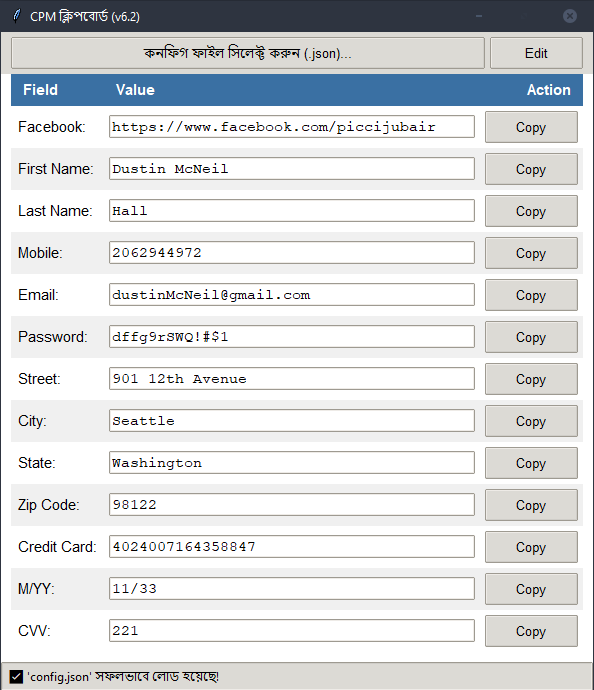

# CPM ক্লিপবোর্ড (CPM Clipboard) v6.2

এটি একটি ছোট ডেস্কটপ টুল যা আপনাকে একটি `.json` ফাইল থেকে তথ্য দ্রুত ক্লিপবোর্ডে কপি করতে সাহায্য করে। এটি ফর্ম পূরণ করা, লগইন করা বা বারবার একই তথ্য টাইপ করার কাজকে অনেক সহজ করে দেয়।

---

## ✨ ফিচারসমূহ (Features)

* **দ্রুত কপি:** এক ক্লিকে যেকোনো তথ্য (নাম, ঠিকানা, ইমেইল, পাসওয়ার্ড) ক্লিপবোর্ডে কপি করা যায়।
* **এডিট ও সেভ:** অ্যাপের ভেতর থেকেই ডেটা এডিট করে মূল `.json` ফাইলে সেভ করা যায়।
* **অটো-লোড:** অ্যাপটি শেষবার ব্যবহার করা `.json` ফাইলটি মনে রাখে। তাই অ্যাপ চালু করলে স্বয়ংক্রিয়ভাবে শেষ ফাইলটি লোড হয়ে যায়।
* **সহজ ইন্টারফেস:** পরিষ্কার এবং ব্যবহারকারী-বান্ধব ডিজাইন।

---

## 🚀 কীভাবে ব্যবহার করবেন (How to Use)
১. ডেটা ফাইল তৈরি (সবচেয়ে গুরুত্বপূর্ণ)
এই টুলটি কাজ করার জন্য আপনার তথ্যগুলো একটি নির্দিষ্ট ফরম্যাটের .json ফাইলে রাখতে হবে।

নিচে একটি স্যাম্পল ফরম্যাট দেওয়া হলো। আপনি এই লেখাটি কপি করে একটি নতুন ফাইল (যেমন: my_data.json) তৈরি করে সেখানে পেস্ট করুন এবং নিজের তথ্য দিয়ে পরিবর্তন করে নিন।

স্যাম্পল my_data.json ফাইল:

`{
  "Facebook": "[https://facebook.com/your_profile_id](https://facebook.com/your_profile_id)",
  "FirstName": "YourFirstName",
  "LastName": "YourLastName",
  "Mobile": "01700000000",
  "Email": "user@example.com",
  "Password": "YourStrongPassword123",
  "Street": "123 Main St, Apt 4B",
  "City": "Dhaka",
  "State": "Dhaka",
  "ZipCode": "1212",
  "CreditCard": "1234567890123456",
  "MY": "12/25",
  "CVV": "123"
}`
## ফাইল লোড করা (শুধুমাত্র প্রথমবার)
* অ্যাপটি প্রথমবার চালু হলে, "কনফিগ ফাইল সিলেক্ট করুন (.json)..." বাটনে ক্লিক করুন।
* আপনার তৈরি করা .json ফাইলটি (যেমন: my_data.json) সিলেক্ট করুন।
* সফলভাবে লোড হলে, আপনি সব তথ্য অ্যাপের মধ্যে দেখতে পাবেন।
## ডেটা কপি করা (মূল ব্যবহার)
* যেকোনো তথ্যের ডান পাশে থাকা "Copy" বাটনে ক্লিক করুন।
* সেই তথ্যটি আপনার ক্লিপবোর্ডে কপি হয়ে যাবে।
* আপনি এখন যেকোনো জায়গায় (যেমন: ব্রাউজার, নোটপ্যাড) পেস্ট (Ctrl+V) করতে পারবেন।
## ডেটা এডিট ও সেভ করা
যদি কোনো তথ্য পরিবর্তন করার দরকার হয়, উপরে ডানদিকে থাকা "Edit" বাটনে ক্লিক করুন।
সবগুলো ফিল্ড এডিট করার জন্য খুলে যাবে।
* আপনার প্রয়োজনীয় তথ্য পরিবর্তন করুন। 
* পরিবর্তন করা শেষ হলে, বাটনটি "Save"-এ পরিণত হবে। "Save" বাটনে ক্লিক করুন।
* আপনার পরিবর্তনগুলো মূল .json ফাইলে সেভ হয়ে যাবে।
##অটো-লোড ফিচার
* আপনি একবার ফাইল লোড করার পর, অ্যাপটি বন্ধ করে আবার চালু করলেও এটি স্বয়ংক্রিয়ভাবে সেই শেষ ফাইলটি লোড করে নেবে। আপনাকে বারবার ফাইল সিলেক্ট করতে হবে না।
